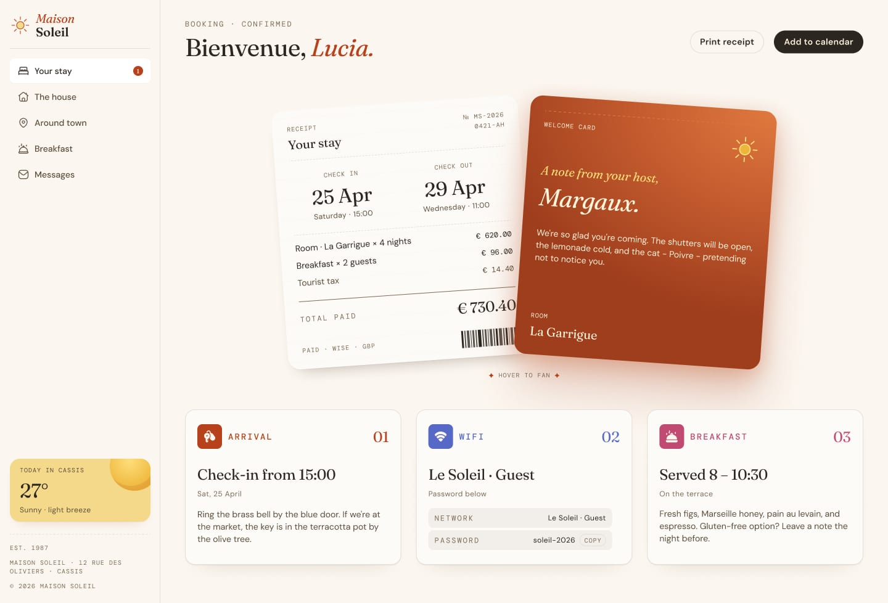
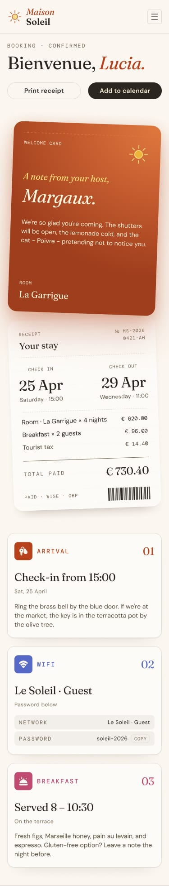

<div align="center">

# 🏨 Hotel Booking Confirmation Page

### Frontend Mentor Challenge Solution

## 🚀 [Ver Site ao Vivo →](https://anaclarissi.github.io/hotel-booking-confirmation-page/)

<br>

[](https://www.frontendmentor.io/challenges/hotel-booking-confirmation-page)
[](https://www.frontendmentor.io/profile/anaClarissi)

</div>

---

## 📸 Preview

### 🖥️ Desktop



### 📱 Mobile



> *Imagens de preview geradas a partir do design oficial do desafio.*

---

## 🎯 Sobre o Projeto

Este projeto é uma solução para o desafio **Hotel Booking Confirmation Page** da plataforma [Frontend Mentor](https://www.frontendmentor.io). O objetivo foi reproduzir fielmente uma página de confirmação de reserva de hotel, com foco em layout responsivo, animações de cartão, cópia de senha via Clipboard API e fidelidade ao design proposto.

> ⚠️ **Este projeto não possui fins lucrativos.** Foi desenvolvido exclusivamente para fins de aprendizado e prática de habilidades em desenvolvimento front-end.

---

## 🔗 Links

| Recurso | URL |
|---|---|
| 🌐 Site ao vivo | [anaclarissi.github.io/hotel-booking-confirmation-page](https://anaclarissi.github.io/hotel-booking-confirmation-page/) |
| 🎯 Desafio original | [Frontend Mentor – Hotel Booking Confirmation Page](https://www.frontendmentor.io/challenges/hotel-booking-confirmation-page) |
| 👤 Meu perfil | [frontendmentor.io/profile/anaClarissi](https://www.frontendmentor.io/profile/anaClarissi) |

---

## 🛠️ Tecnologias Utilizadas

- **HTML5** — Estrutura semântica e acessível
- **CSS3** — Estilização personalizada com variáveis CSS (custom properties)
- **Bootstrap 5.3** — Navbar responsiva com menu hamburguer e grid
- **JavaScript** — Clipboard API para cópia de senha e toast de feedback
- **Google Fonts** — Fontes *Fraunces*, *DM Sans* e *DM Mono*

---

## 📚 Aprendizados

Esse desafio foi uma ótima oportunidade para consolidar e aprofundar conhecimentos importantes:

### 🎨 CSS Avançado
- Uso de **variáveis CSS** (`--terracotta-600`, `--sun-300`, etc.) para manter consistência visual e facilitar manutenção
- Animação de cartões empilhados com `transform: rotate()` e `translateX()` para criar o efeito de "leque"
- Uso do seletor `:has()` para detectar hover em um elemento e aplicar transformações nos cartões irmãos, sem nenhum JavaScript

```css
.receipts-booking--cards:has(.hover-to-fan-text:hover) .card-booking {
    transform: rotate(-4deg) translateX(20%);
}

.receipts-booking--cards:has(.hover-to-fan-text:hover) .card-receipt {
    transform: rotate(4deg) translateX(-20%);
}
```

### 📐 Layout Responsivo
- Construção mobile-first com breakpoints em `1024px` e `1440px`
- Sidebar fixa no desktop com `position: fixed` e margem no `main` para compensar
- Seção de cartões transitando de coluna única (mobile) para sobreposição lado a lado (desktop)
- Grid de 3 colunas para os cards de informações do hóspede no desktop

### 🧩 Bootstrap na Prática
- Integração do **Navbar collapse** do Bootstrap com customizações visuais profundas via CSS próprio
- Override de estilos padrão do Bootstrap sem conflitos, respeitando a especificidade dos seletores
- Alternância de ícone do menu (hamburguer → fechar) de forma puramente declarativa com `:has()` e CSS

### 🖱️ JavaScript & Clipboard API
- Cópia da senha Wi-Fi para a área de transferência com a **Clipboard API** assíncrona
- Exibição de um toast animado via `classList` e `setTimeout` para dar feedback ao usuário

```js
async function copy() {
    const password = document.querySelector("#password").textContent;
    try {
        await navigator.clipboard.writeText(password);
        showAlert();
    } catch (error) {
        console.error("Failed copy: ", error);
    }
}
```

### ♿ Acessibilidade
- Uso de `aria-hidden="true"` em elementos puramente decorativos
- `aria-label` e `aria-expanded` no botão de toggle da navbar
- Alternância de ícone do menu acessível via CSS com `:has()` e `::before`

---

## 📁 Estrutura do Projeto

```
hotel-booking-confirmation-page/
├── index.html
└── src/
    ├── css/
    │   └── style.css
    ├── js/
    │   └── script.js
    └── assets/
        ├── fonts/
        │   ├── fraunces/
        │   ├── dm-sans/
        │   └── dm-mono/
        └── images/
            ├── logo.svg
            ├── icon-bed.svg
            ├── icon-weather.svg
            ├── icon-barcode.svg
            └── ...
```

---

## 🚀 Como Rodar Localmente

```bash
# Clone o repositório
git clone https://github.com/anaClarissi/hotel-booking-confirmation-page.git

# Acesse a pasta
cd hotel-booking-confirmation-page

# Abra o arquivo index.html no seu navegador
# Ou use a extensão Live Server no VS Code
```

---

<div align="center">

Desenvolvido com 💙 por **Ana Clarissi** como solução de desafio [Frontend Mentor](https://www.frontendmentor.io)

</div>